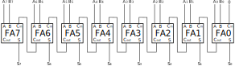
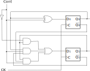

# Av2 - 2° Semestre de 2021

Avaliação 2 - Elementos de Sistemas

| Pontos HW    | Pontos SW      |
| :--------:   | :--:           |
|   50         |  10            |

- Avaliação individual com consulta ao repositório da disicplina e fork do grupo.
- 100 min total.
- Ficar conectado no canal geral no Teams (para ouvir instruções).
- Ficar no blackboard durante a prova.
- Fazer commit ao final de cada questão.
- Lembre de dar **push** ao final.

Para testar basta descomentar o módulo que deseja validar no arquivo `config_testes.txt` e executar o comando `python3 ./testeHW.py` .

## 1. Lógica combinacional

| Pontos HW    | Pontos SW      |
| :--------:   | :--:           |
|   15         |  0            |

A figura abaixo ilustra um sistema de bombas que se deseja controlar a partir de um sistema digital.

Características do sistema:

- As entradas do sistema são seis sensores de nível, sendo três para cada tanque.
- Os sensores são ativos em nível lógico '1' na presença de água. Por exemplo, se o tanque 1 estiver cheio, os sensores indicarão S0 = '1', S1 = '1' e S2 = '1'.
- O sistema possui três saídas: B1 e B2 que indicam se as bombas são ligadas ou desligadas (nível lógico '1' indica ligada e nível lógico '0' indica desligada) e A que é um alarme de mau funcionamento (A = '1' ativa o alarme).

Funcionamento:

- A bomba 2 deve ser ligada se o nível do tanque 2 estiver abaixo de S4 e o nível do tanque 1 estiver acima de S0.
- A bomba 1 deve ser ligada se o nível do tanque 1 estiver abaixo de S1.
- Se houver alguma inconsistência nos dados (por exemplo, S2 = 1 e S0 = 0), ambas as bombas devem ser desligadas independente dos valores dos sensores e o alarme deve ser ativado.
- O alarme também deve ser ativado se ambos os tanques estiverem abaixo do nível mínimo ou se estiverem cheios.

### Implementação

Implemente as funções lógicas para as saídas no arquivo `src/tanques.vhd`

**Lembre de descomentar o módulo no arquivo config_testes.txt e testar com `./testeHW.py`**

#### Rúbrica para avaliação:

| Pontos HW    | Descritivo     |
| :--------    | :--            |
|   15         |  As três saídas implementadas e funcionando      |
|   10         |  Duas saídas implementadas e funcionando         |
|   5          |  Uma saída implementada e funcionando            |

## 2. Detecção de erro

| Pontos HW    | Pontos SW      |
| :--------:   | :--:           |
|   10         |  0             |

A transmissão de dados digitais está sujeita a erros que podem ser causados por interferência eletromagnética, envelhecimento dos componentes, entre outros. Um método de detecção de erros de 1 bit é o método da paridade, que funciona da seguinte forma: um bit de redundância é adicionado à sequência de bits da mensagem segundo a regra:

- Caso o bit '1' apareça um número ímpar de vezes na mensagem, o bit de paridade será '1'.
- Caso o bit '1' apareça um número par de vezes na mensagem, o bit de paridade será '0'.

### Implementação

Implemente no arquivo `src/deteccao.vhd` a detectação do erro através da paridade. A entrada será um vetor de 5 bits, sendo o bit mais significativo o de paridade e os outros 4 bits a mensagem. A saída E deve receber '0' se não houver erro e '1' se algum erro for detectado.

**Lembre de descomentar o módulo no arquivo config_testes.txt e testar com `./testeHW.py`**

Exemplos:

entrada = '10011' -> E = '1'

entrada = '00011' -> E = '0'

#### Rúbrica para avaliação:

| Pontos HW    | Descritivo     |
| :--------    | :--            |
|   10         |  Implementação usando funções lógicas            |
|   5          |  Implementação através de condicionais (with, when, if)         |

## 3. Full Adder com Problema

| Pontos HW    | Pontos SW      |
| :--------:   | :--:           |
|   10         |  0             |

Uma implementação de um Full Adder de 8 bits está retornando os seguintes valores:

| Soma   | Resultado      |
| :--------:   | :--:           |
|10100101 + 01011111 | 11100100 |
|10011100 + 10111000 | 00010100 |
|10011100 + 01000011 | 11111111 |

Como pode-se notar, o somador não está funcionando adequadamente. Considerando que o Full Adder de 8 bits deveria ser obtido pela associação de 8 Full Adders de 1 bit em cascata como mostrado na figura abaixo, identifique qual o erro e onde se localiza. Os erros só podem estão na ligação entre blocos, isto é, todos os Full Adders de 1 bit estão funcionando corretamente.

### Resposta

Escreva a resposta no arquivo `src/Defeito_full_adder.txt`.

#### Rúbrica para avaliação:

| Pontos HW    | Descritivo     |
| :--------    | :--            |
|   10         |  Erro e localização identificados            |
|   5          |  Localização do erro identificada            |

## 4. Arquivo de teste

| Pontos HW    | Pontos SW      |
| :--------:   | :--:           |
|    0         |  10            |

O arquivo `src/carry.vhd` implementa um somador de 8 bits com a detecção de overflow.

A saída C será '1' quando ocorrer overflow. Escreva um arquivo para testar se a implementação do overflow está correta.

### Implementação

O teste deverá ser implementado no arquivo `testes/tb_carry.vhd`, cujo cabeçalho já está preenchido.

#### Rúbrica para avaliação:

| Pontos SW    | Descritivo     |
| :--------    | :--            |
|   10         |  Teste verifica as condições de overflow e não overflow para números positivos e negativos            |
|   5          |  Teste parcialmente implementado            |

## 5. Contador

| Pontos HW    | Pontos SW      |
| :--------:   | :--:           |
|   15         |  0             |

O circuito lógico sequencial da figura abaixo é um contador síncrono de módulo 4 (conta de "00" a "11").

### Implementação

Implemente o contador no arquivo `src/contador.vhd`. Extraia o RTL do circuito e as formas de onda a partir da execução dos testes.

**Lembre de descomentar o módulo no arquivo config_testes.txt e testar com `./testeHW.py`**

_Utilize o FlipFlopD já fornecido. Atribua '0' à entrada preset dos FFDs e ligue o _clear_ do contador ao _clear_ dos FFDs._
    
#### Rúbrica para avaliação:

| Pontos HW    | Descritivo     |
| :--------    | :--            |
|   15         |  Circuito implementado e funcionando. RTL E formas de onda apresentados      |
|   10         |  Circuito implementado e funcionando. RTL OU formas de onda apresentados     |
|   5          |  Circuito implementado e funcionando            |
